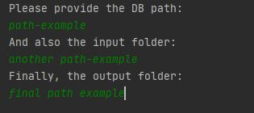
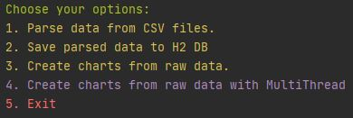

## How to use


#### Maven Build
In your root directory:
```$xslt
mvn package
```

#### Run the application
In your root directory:
```$xslt
java -jar target/assignment-1.0-SNAPSHOT.jar
```

#### Example
Provide Input, Output and Database path



Choose options:


